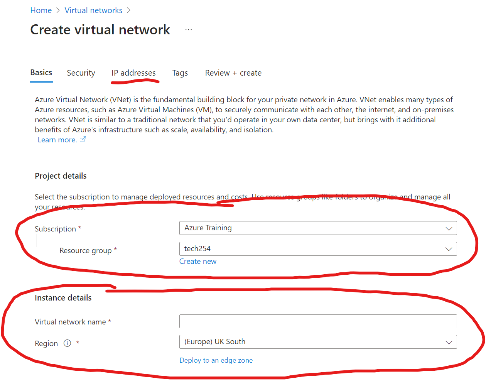

# Creating a Virtual Network on Azure

1. Access the virtual networks page  
   1. Go to the Azure homepage.  
   2. In the top center, select the search bar and type in either "vn" or "virtual network"  
   3. Under services select Virtual Networks  
   
2. Create a new virtual network  

3. Fill out the Basics  
    1. Ensure that Resource group is "tech254" under subcription "Azure Training"  
    2. Write in the name of virtual network (Note: use naming convention)  
    3. Go to IP addresses    

4. Fill out IP addresses  
    1. Ensure that IPv4 is selected and not IPv6  
    2. Enter the IP range for the VN (Same as AWS VPC) "10.0.0.0/16"  
    3. Edit existing subnet by clicking the pencil   
       1. Change name to public-subnet
       2. Set up starting address and subnet size "10.0.2.0/24"
       3. save
       
    4. Create new subnet and repeat for private subnet ("10.0.3.0/24")
    5. Go to Tags

5. Fill out Tags
   1. Name set to "Owner"
   2. Value set to your first name
   3. Go to Review + create
6. Review your settings 
7. Create
