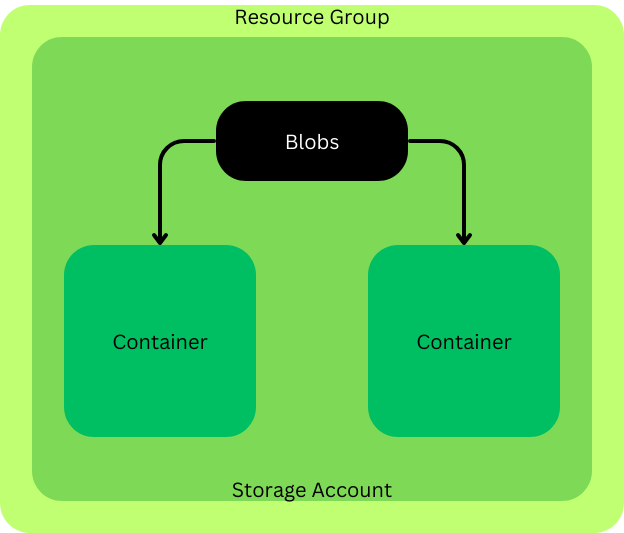

# Blob Storage

### What is it?

- Azure Blob storage is a feature of Microsoft Azure. It allows users to store large amounts of unstructured data on Microsoft's data storage platform. In this case, Blob stands for Binary Large Object, which includes objects such as images and multimedia files.
- https://www.snaplogic.com/glossary/azure-blob-storage#:~:text=Azure%20Blob%20storage%20is%20a,as%20images%20and%20multimedia%20files.

### Blob Storage Architecture

- Blob storages are created as a storage account inside a resource group. Inside the storage account you can have a series of containers to which the blob data is stored

### The different access tiers to blob storage

### Redundancy options with blob storage.

  
Two of the available redundancy options are LRS (Local Redundancy Storage) and ZRS (Zone Redundancy Storage)
- LRS stores 3 versions of the storage account in one availability zone in a region, this prevents redundancy from one of the accounts failing.
- ZRS is the next best stage to Redundancy storage where the three storage accounts are placed across the three zones in a region meaning that if a zone was made redundant there is still two more available unlike the LSA. However, this option will be more expensive.
