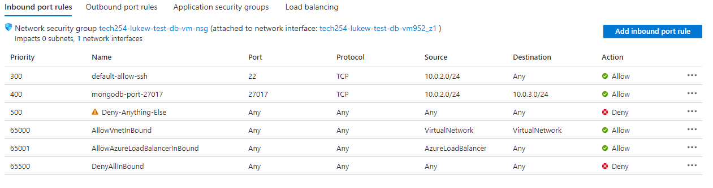

# How to secure your database.
This guide shows you how to set up your database instance such that it provides extra security, even after creating it.
1. Go to your db Virtual Machine
2. In settings select Networking
3. set up the following rules

## Example set-up

