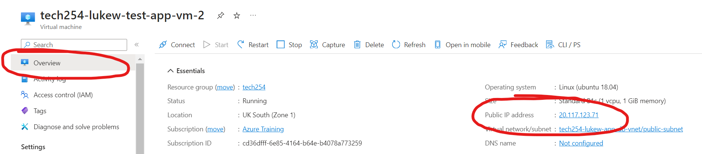
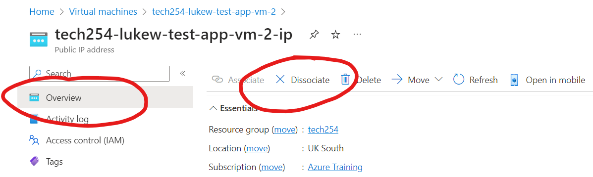

# How to dissociate your Public IP
This is a guide on how you dissociate your Public IP address on your Virtual Machine on Microsoft Azure
1. Go to your instance with Public IP on.
2. In overview, select your IP address.

3. Select Dissociate and confirm yes.

